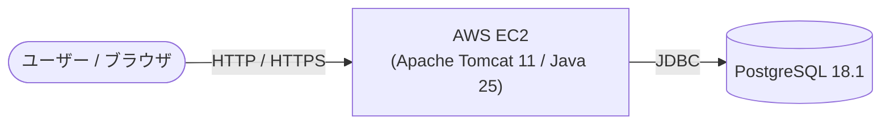

[README.md](https://github.com/user-attachments/files/33024766/README.md)[Uploading REA# アプリケーション「冷蔵庫コンシェルジュ」

[](https://openjdk.org/)
[](https://tomcat.apache.org/)
[](https://www.postgresql.org/)
[](https://aws.amazon.com/)
[](https://www.eclipse.org/)
[](https://a5m2.mmatsubara.com/)
[](https://antigravity.google/)

家庭系フードロスの削減をテーマに開発した、食材管理＆レシピ提案アプリです。
日本の食品廃棄の約半分を占める家庭でのロスに着目し、冷蔵庫内の食材の数量や賞味期限をWeb上で優しく管理できる仕組みを作りました。残った食材から作れるレシピを提案することで、日常の使い忘れや期限切れを自然に防ぎ、日々のエコな食生活をサポートします。

> [!NOTE]  
> **本プロジェクトは、Java実習時に作成したコンテンツ（ポートフォリオ）です。**  
> * **開発期間**: 26日 (要件定義、プログラム設計、コーディング)
> * **開発規模**: 1.7Kstep  
> 
> Java実習の内容は以下よりご覧いただけます。  
> 👉 **[Java実習の内容はこちら](https://github.com)**  
> *(※別タブで開く場合は Ctrl + クリック / Cmd + クリック 推奨)*

---

## 📑 目次
1. [💻 画面イメージ](#画面イメージ)
2. [✨ 主な機能](#主な機能)
3. [🧰 使用技術・開発環境](#使用技術開発環境)
4. [📐 システム構成](#システム構成)
5. [🌐 動作確認（デモ環境）](#動作確認デモ環境)
6. [📖 要件定義書・画面設計書](#要件定義書画面設計書)
7. [🛠️ ローカル環境での実行・セットアップ手順](#ローカル環境での実行セットアップ手順)
8. [💡 工夫した点](#工夫した点)
9. [🧗 苦労した点・得られた教訓](#苦労した点得られた教訓)

---

## 💻 画面イメージ

*(※ 掲載している画像はシステム画面の一部抜粋です。全画面イメージや詳細な画面フローは [要件定義書・画面設計書](#要件定義書画面設計書) よりご覧いただけます)*

| メイン画面 <br><sub>※一部抜粋</sub> | 食材一覧画面 <br><sub>※一部抜粋</sub> |
| :---: | :---: |
|  |  |
| 残った食材から作れるレシピをレシピのＤＢより提案 | 冷蔵庫内の食材の数量や賞味期限を一元管理 |

---

## <span style="color:#0033c4;">✨</span> 主な機能

* <span style="color:#0033c4;">●</span> **冷蔵庫の食材在庫管理**
  * 冷蔵庫内にある食材の名前、カテゴリ（種別）、数量、賞味期限の直感的な登録・一覧確認
  * 野菜類の賞味期限自動算定機能（未入力時に登録日から+7日を自動設定）や、編集・一括削除機能
* <span style="color:#0033c4;">●</span> **賞味期限アラート（ダッシュボード）**
  * メイン画面（ダッシュボード）にて、当日を起点に賞味期限が2日以内の食材を自動検知してアラート表示
  * 食品の使い忘れや期限切れによる廃棄のタイミングを視覚的に把握
* <span style="color:#0033c4;">●</span> **賞味期限連動型のレシピ提案**
  * 賞味期限が近い食材を自動抽出し、それらを優先的に消費できるおすすめレシピを最大3件自動検索・推薦
  * レシピ詳細（材料・作り方）のアコーディオン展開、および「お気に入り（☆/★）」登録・管理機能
* <span style="color:#0033c4;">●</span> **調理後の食材自動消費（食品削除）**
  * 提案レシピから実際に調理・作成した際、使用した食材をボタン一つで選択・一括削除（消費）できる専用画面
  * 賞味期限アラート対象の食材を赤文字ボタンで区別し、使い切った食材を簡単に在庫から反映
* <span style="color:#0033c4;">●</span> **認証・アカウント機能**
  * 登録されたテストユーザーによるログイン・ログアウト機能および、不正なURL直接遷移を防ぐセッション制御


---

## 🧰 使用技術・開発環境

| カテゴリ | 技術スタック / バージョン |
| :--- | :--- |
| **開発期間** | 26日 |
| **開発規模** | 1.7Kstep |
| **言語・ランタイム** | Java 25 (OpenJDK) |
| **Webコンテナ / APサーバ** | Apache Tomcat 11 |
| **バックエンドフレームワーク** | Java (Servlet / JSP) |
| **データベース** | PostgreSQL 18.1（テーブル生成用 [DDL.sql](DDL.sql) を同梱） |
| **インフラ / ホスティング** | AWS (EC2) |
| **統合開発環境 (IDE)** | Eclipse |
| **DB管理・設計ツール** | A5:SQL Mk-2 |
| **開発支援（AI）** | Antigravity |

---

## 📐 システム構成



---

## 🌐 動作確認（デモ環境）

AWS上にデプロイしており、実際に動作をご確認いただけます。

👉 **[「冷蔵庫コンシェルジュ」デモサイトはこちら](http://13.193.142)**  
*(※別タブで開く場合は `Ctrl + クリック` / `Cmd + クリック` 推奨)*

> **テスト用ログイン情報**  
> * **ID**: `aaaa`  
> * **パスワード**: `1234`

---

## 📖 要件定義書・画面設計書

👉 **[Web版 要件定義書・画面設計書はこちら（GitHub Pages）](https://github.io)**  
*(※リンクを別タブで開く場合は `Ctrl + クリック`（Macは `Cmd + クリック`）してください)*  
*(※システム仕様・各画面イメージ・業務フローの詳細をWebページ形式でご覧いただけます)*

---

## 🛠️ ローカル環境での実行・セットアップ手順

ローカル環境で本プロジェクトを実行する場合は、以下の環境準備、データベースのセットアップ、およびデータベース接続設定が必要です。

### 1. 前提条件
* **Java**: JDK 25
* **Webコンテナ**: Apache Tomcat 11
* **データベース**: PostgreSQL 18.1
  * ※ プログラムを実行する際に必要な環境として、データベースのテーブル生成用DDL（[`DDL.sql`](DDL.sql)）をプロジェクトルート直下に公開・同梱しています。

### 2. データベースの構築（テーブル生成用DDLの実行）
プログラムの実行に必要なテーブル群を生成するため、公開しているテーブル生成用DDL（[`DDL.sql`](DDL.sql)）を実行してください。

1. PostgreSQLにて任意のデータベース（例: `recipe`）を作成します。
2. 作成したデータベースに対して、プロジェクトルート直下の [`DDL.sql`](DDL.sql) を実行してテーブルを作成します。  
   *(※ A5:SQL Mk-2、pgAdmin、または `psql` コマンドライン等から実行可能です)*

### 3. データベース設定ファイルの作成
セキュリティ保護のため設定ファイル自体はリポジトリ管理外となっています。  
`/src/main/java/` 配下に `db.properties` を作成し、ご自身のローカルDB環境に合わせて接続情報を設定してください。

> **リポジトリ内に `db.properties.sample` を用意していますので、リネームしてご利用いただけます。**

#### `db.properties` の記述例
```properties
db.url=jdbc:postgresql://localhost:5432/データベース名
db.user=ユーザ名
db.password=パスワード
db.driver=org.postgresql.Driver
```

---

## <span style="color:#0033c4;">💡工夫した点

### 1. 入力負荷を軽減する賞味期限の自動算定
* **野菜カテゴリの最適化**: 食材登録時に毎回賞味期限を入力するユーザーの負担を減らすため、傷みやすい「野菜」は未入力でも自動で「登録日＋7日」を初期値に設定するロジックを実装し、継続しやすいUXを実現しました。

### 2. 「作」ボタンと連動したシームレスな在庫消費導線
* **調理と管理の一体化**: レシピ詳細の「作（作った）」ボタンから「食品削除画面」へ直接遷移する導線を設計しました。調理した流れのまま在庫を一括更新できるため、データの更新漏れを自然に防ぐ工夫をしています。

### 3. データの誤操作を防止する閲覧・編集モードの分離
* **フェイルセーフな画面設計**: スクロール時などの誤操作によるデータ変更を防ぐため、初期状態を「ロックされた閲覧モード」に設定。明示的にボタンを押した時のみ編集可能とし、中断ボタンも配置して安全性を高めました。

---

## <span style="color:#0033c4;">🧗</span> 苦労した点・得られた教訓

### 1. 賞味期限と食材一致数を考慮した、多条件レシピ推薦アルゴリズムの構築
フードロス削減という目的を達成するため、単にレシピを全件表示するのではなく、「冷蔵庫内で最も賞味期限が近い食材を最優先で消費できるレシピ」を自動選別するロジックの実装に最も苦労しました。また、アラート対象の食材や、それに関連するレシピが万が一存在しない場合でも画面が破綻しないような例外的な選別方法（フォールバック）を考慮する必要がありました。

* **アプローチ内容（Javaによる独自ソート処理）**:
  * SQLの `GROUP BY` と `MIN(expiration_date)` を用い、ユーザーごとに各食材の「最も古い賞味期限」をマップ（`Map<Integer, Date>`）として事前に抽出
  * Java側でレシピごとのスコアリングクラス（内部クラス `RecipeScore`）を定義し、該当食材の「賞味期限の近さ」を第一優先、消費できる「食材の一致数」を第二優先とするカスタムコンパレータ（`Comparator`）を実装
  * アラート食材がない場合でも、食材の一致数やレシピIDを基準とした判定へとシームレスに切り上がるように条件分岐を設計し、常に安定して最適なレシピを「最大3件」選別して返却する堅牢なロジックを完成させました。

### 2. 多段階ポップアップの動的制御とタイミング調整
未入力の警告、更新確認、処理中のローディング、成否通知など、ユーザーの選択（はい／いいえ）によって細かく分岐するポップアップの画面制御に苦労しました。特に処理成功時に「3秒後に自動ですべてを閉じて画面遷移する」といった非同期のタイミング調整が難所でした。

### 3. 大量データ取得時のパフォーマンス改善（ページネーションの実装）
初期の実装では、レシピ一覧画面（約50件）の全データを一度にデータベース（PostgreSQL）から取得してスクロール表示させていたため、画面の読み込み（描画速度）に大幅な遅延が発生するという技術的課題に直面しました。

* **アプローチ内容**:
  * 全件一括取得を廃止し、「前ページ」「次ページ」ボタンによる**ページネーション（ページング処理）**を導入
  * 1ページあたり「6明細ずつ」に限定してSQLでデータを分割取得（OFFSET・LIMIT句の活用）するロジックへ刷新し、通信量と描画負荷を大幅に削減して高速化を実現

### 4. 生成AI（Antigravity）を活用した協調開発とロジックの品質確保
本システムの実装フェーズでは、開発効率向上のためAIへのコーディング指示を取り入れました。しかし、AIに意図通りの正しい挙動を理解させ、バグのない堅牢なソースコードを出力してもらうための指示（プロンプト）の組み立てに非常に苦労しました。

* **アプローチ内容**:
  * 曖昧な表現を排除し、処理の優先順位や例外時の挙動まで網羅した、極めて緻密で詳細な指示書（プロンプト）を作成
  * コード生成とテスト（挙動確認）を何度も繰り返し、期待値とズレがある場合は指示書側をブラッシュアップして再生成させるイテレーション開発を徹底。単にAIに依存するのではなく、生成されたソースコードのロジックを1行ずつ深く理解し、セキュリティやパフォーマンスの検証を自ら行うことで品質を担保しました。

### <span style="color:#0033c4;">💡</span> 得られた教訓
この開発経験から、以下の教訓を得ることができました。
1. **データ量が増加した際のパフォーマンス（動作速度）低下を未然に防ぐ、バックエンドでの効率的なデータ制御手法（ページネーション）の重要性**
2. **仕様の隙をなくし、データが存在しない例外的な状況でもシステムを安定して稼働させるための、柔軟なアルゴリズム設計と条件分岐の組み立てスキル**
3. **AI協調型開発における、AI出力を制御するための「必要十分な条件を満たした詳細設計・指示」の重要性と、生成コードを自らレビュー・デバッグするスキルの必要性**

これらの教訓は、実務における大規模なWebアプリケーション開発や、最新のAI技術を取り入れた効率的なチーム開発・設計書駆動開発のフェーズにおいても非常に役立つ知見であると確信しています。
DME.md…]()
